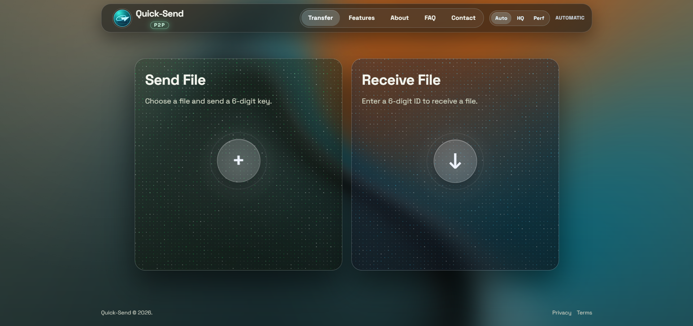
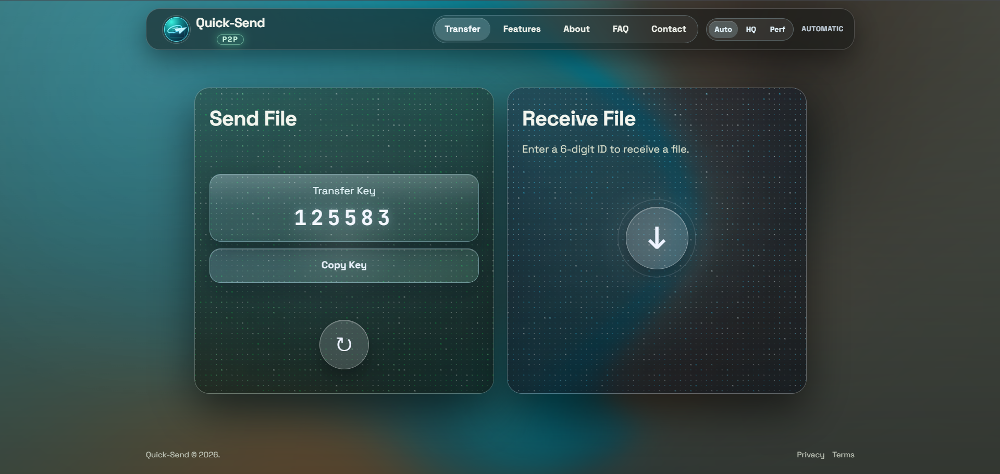
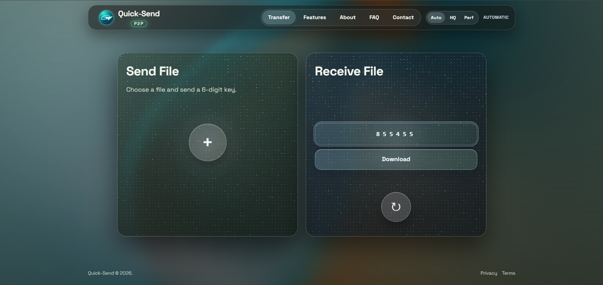
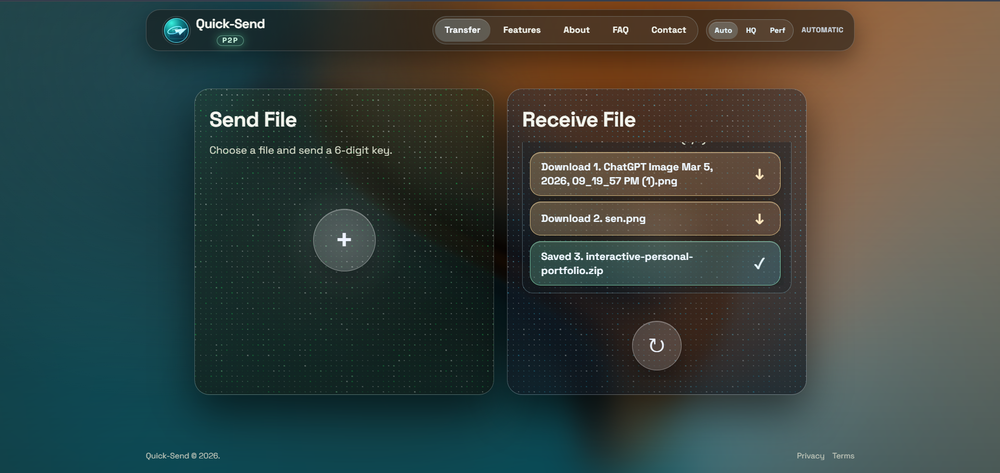

# Quick-Send

Quick-Send is a web app for instant one-to-one file sharing using a simple 6-digit transfer code.

This public repository is a showcase page only.

## Live Project

- Website: https://quick-send.vercel.app

## Product Highlights

- Fast browser-based file transfer experience
- Simple sender/receiver flow with transfer code
- Multi-file transfer support
- Clean mobile and desktop interface
- Privacy-focused user flow

## Screenshots

Add your screenshots inside an `images/` folder in this public repo and keep these filenames:

## Demo Links

- Live Website: https://quick-send.vercel.app
- Product Walkthrough Video: https://www.youtube.com/
- LinkedIn Project Post: https://www.linkedin.com/

## About This Public Repo

- This repository is intended for product presentation.
- Core source code is maintained privately.

## Contact

- Email: aitechinsightsdaily@gmail.com
